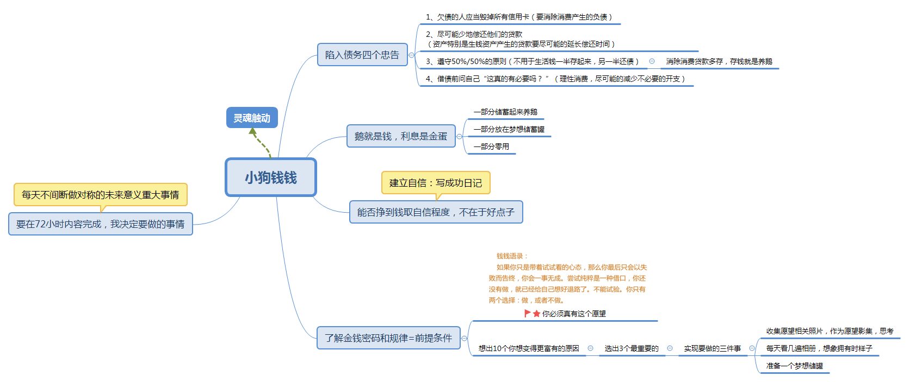

# 总结大作业

[TOC]

小狗钱钱思维导图

> 理清自己当前的财务情况，包括负债、支出、可用资金以及目标

### 1.1、养鹅

> 养一只自己的鹅，哪怕现在没有，从小养起，先有鹅，然后才会有蛋。
>
> 合理规划自己的支出

### 1.2、富人思维的培养

> 穷人的思维，往往意思不到自己是穷人的思维，所以需要从思维的根源改变。但思维的改变不会让你立马变得有钱。也不会因为你突然得到一大笔钱面产生富人的思维。**有钱≠富人思维**

### 1.3、目标

- 制定自己的理财目标

  > 在制定目标，需要根据时间，以及自身条件先定义一个初级容易实现的。并且制定一个长远的目标，在达到目标的过程中，也需要根据不同时期的环境适当的调整。

### 1.4、资产的内涵

- **资产的内涵是现金流**

### 1.5、三大资产

1. 生钱资产：能给你持续带来净现金流入的东西。
2. 耗钱资产：持有期间能给你【持续】带来净现金流出的东西
3. 其他资产：持有期间产生的净现金流为0的东西。

### 1.6、怎么实现财务自由

1. 生钱资产产生的非工资收入覆盖日常总支出
2. 要想富有你只要不断买入生钱资产
3. 一定要是【持续】带来净现金流入的生钱资产

### 1.7、穷人富人的区别

富人：

​		1、生钱资产占总资产的80%以上；

​		2、好支出占总支出的80%以上；

穷人：

​		1、毫无任何生钱资产可言，生活的唯一收入就是工资。

​		2、不知道支出也分好坏，坏支出占了总支出的80%以上。

- 所以学习理财要趁早。越早学习理财，越能提前实现财务自由。
- **提升财富要靠工资和非工资收入【两条腿】走路，绝对不能独腿前行。**

### 1.8、复利

- 复利的公式是：**最终收益=本金*（1+收益率）^时间**

#### 1.8.1、本金

> 复利的第一个重点要素：本金
>
> 但是本金的影响其实没有那么大，而且本金在短期内是很难改变的

#### 1.8.2、时间

> 理财的时间差，所产生的收益差也是几倍。
>
> 所以投资越早越好，学习理财越早开始越好。

#### 1.8.3、收益率

- 影响复利的是收益率，这个也是三大要素中我们最容易掌握的。

- 所以要改变自己思维的懒惰，提升自己的理财能力，避开复利反向。

### 1.9、实现财务自由的三大核心工具

- 企业、股票、REITs

  > 1. 用好了企业这个核心工具，你会成为企业家
  > 2. 用好了股票或REITs这两个核心工具，你会成为投资家；
  > 3. 用好了企业、股票、房地产这三个工具，你会成为资本家。

【重点一】：**无风险投资工具，尤其关注逆回购、货币基金**

【重点二】：**低风险投资工具，尤其是生钱资产的股票、REITs**

【重点三】：**我们实现财务自由的三大核心工具——股票、REITs、企业**

**一句话总结：投资第一原则：不懂不要投，懂了安心投，盲目“尝试”无疑送命，系统训练方可真正保住钱“命”**

