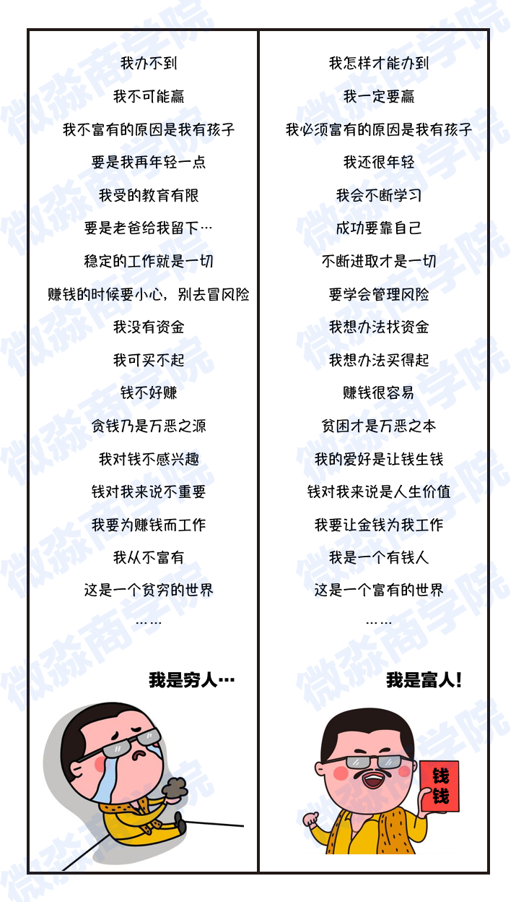

# 理财课程笔记第一天

[TOC]

## 一、债务问题的困扰

```txt
在书中，吉娅的父母深受债务问题的困扰！

债务问题可能很多小伙伴也经历过或者正在经历中。

那么，该怎么防范或化解债务问题呢？
```

## 二、四条忠告

- 欠债的人应当注销所有的信用卡。
- 应当尽可能少地偿还他们的贷款。
- 对于消费贷款，欠债的人应该将不用于生活的钱一半存起来，另一半用于还债。
- 对于所有的消费，都要问自己【这真的有必要吗？】

### 2.1、第一条：要消除因「消费」产生的负债。

> 消费产生的负债是坏负债。坏负债会持续的带来净现金流出，坏负债会让我们在债务的泥潭中越陷越深，越来越穷，最终陷入财务危机之中。
>
> 欠债的人要注销信用卡【重点】其实不在信用卡，而是要减少因消费产生的【坏负债】
>
> 消费贷之类看起来很贴心，但却会让我们越来越穷的东西。

### 2.2、第二条：因资产特别是生钱资产产生的贷款要尽可能的延长偿还时间。

> 「生钱资产」产生的负债是好负债。
>
> 因为生钱资产产生的现金流入能够覆盖贷款产生的现金流出。资产会帮我们还债，而且还会有结余。另外资产的价格还会上涨，这样我们就会越来越富有。

举例

> - 这里举个例子，我们在银行的存款就是银行的负债哈，因为银行需要持续的为我们的存款付利息，1年期定期存款利率大概3%左右，银行把我们的存款贷给其他人或企业，银行每年可以收到6%左右的利息，去掉成本银行还能净赚3%。
>
> - 这样的负债就是好负债哈，因为这样的负债越多，银行赚钱就越多。
> - 2018年工商银行1年的净利润就有2900多亿，可见拥有好负债是多么幸福的一件事情。

### 2.3、第三条：要消除消费贷款，多存钱。

> - 存钱就是养鹅，鹅养肥了它就可以下金蛋。
>
> - 没有鹅的人是没有金蛋收的，是不能富有的。

### 2.4、第四条：要理性消费，尽可能的减少不必要的开支。

> 尽快把自己下金蛋的鹅养肥。

### 2.5 、不要杀死自己的鹅

```txt
一个农夫有一只下金蛋的鹅，农夫开始很高兴。

后来农夫的欲望越来越大，鹅下金蛋的速度赶不上农夫欲望膨胀的速度。

于是农夫就杀鹅取卵，最后农夫没了鹅也没了金蛋，农夫又变成了穷光蛋。
```

### 2.6、想办法养自己的鹅

> 把自己挣的钱，分成三部分：
>
> ⭐️一部分储蓄起来养鹅；
>
> ⭐️一部分放在梦想储蓄罐；
>
> ⭐️一部分零用；
>
> 而把自己二分之一的钱都储蓄起来养鹅。
>
> 而在现实生活中，很多人往往因为控制不了自己的消费欲望而杀死自己的鹅。
>
> 比如说花光自己所有的积蓄去买名牌衣服、包包，贷款买车等。

## 三、思维

> 生活中并不反对买好东西，更不反对过高品质的生活，但是你应该用零用钱或梦想储蓄罐里的钱去买，而不是杀死自己的鹅。
>
> - 第一层次：控制不住消费欲望，为了新出的CD就要花完自己所有的零花钱。
>
> - 第二层次：建立自己的储蓄罐，为了自己的梦想开始运用自己的优点来赚钱，但是没有自己的鹅。
>
> - 第三层次：开始养“鹅”


> 如果一直处于第一个层次，很有可能现在是月光甚至已经负债累累了。
>
> 从这里我们也可以看出，你目前的财务状况其实只是一种结果，富有也好，负债累累也好，往往并不是原因。

### 3.1、是什么原因让你处于第一层次？

> 思维才是最根本的原因！
>
> 穷人思维导致贫穷的结果，富人思维导致富有的结果。
>
> 如果你具备了富人思维，你就会变得越来越富有。
>
> 但是如果你不具备富人思维，即便突然有了很多钱，这笔钱也会离你而去的。
>
> 事实是：世界上90%中彩票大奖的人，10年后的生活比中奖前要悲惨的多。
>
> 思维是穷富的关键，也是穷富的原因。而思维并不会因为你突然有了一大笔钱而改变。

### 3.2、那什么是穷人思维，什么是富人思维呢？



> 当然，穷人思维和富人思维的差别并不仅仅于此。
>
> 更可怕的是，具有穷人思维的人往往意识不到自己是穷人思维。这也是很多人一生都难以富有的深层次原因。

## 四、获得经济独立、财务自由的意义是什么？

### 4.1、答案

> 经济独立、财富自由并不是独善其身，它的本质是让自己、家人变的更好的能力。

### 4.2、【从个人讲】

> 可以更好的选择自己喜欢的东西、自己喜欢的生活方式、婚姻方式，最终实现踏踏实实靠自己，得来属于自己的精神自由。把经济这个生存的“命脉”交给他人，其实就是把自己选择的权力让给了他人，也把自己生活的主动权让给了他人。

### 4.3、【从家庭讲】

>  与爱人共同分担家庭的财务重担，应对老人的医疗花销、孩子的教育花销，让家庭关系因为共同的努力获得财富而更美好，而不是因为钱受到冲击而动摇。

### 4.4、总结

> 提升理财技能，实现财务独立，获得更多自主选择的权力，获得给家人更好的生活的能力。

## 五、目标

### 5.1、财务目标需要认真思考，一定要写好！

> 好的目标需要【用数字具体量化】，主要量化实现的时间和实现的金额。
>
> 简单来说：要思考在多少年之前，实现什么样的财务目标，这样的目标实现起来更有推动性。

### 5.2、常见的财富目标：

> 什么时候还清多少的债务？
> 工资、非工资收入达到多少？
> 买车？买房？存款？
> 旅游储备金、保险等
> 下一代的教育金、上一代的养老金等

### 5.3、好的目标是需要量化的

> 单一的赚钱、买房、买车，由于没有设立具体的目标，是么有办法落地实操的。
>
> 目标需要量化！量化！量化！


