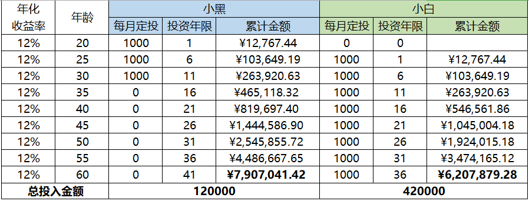
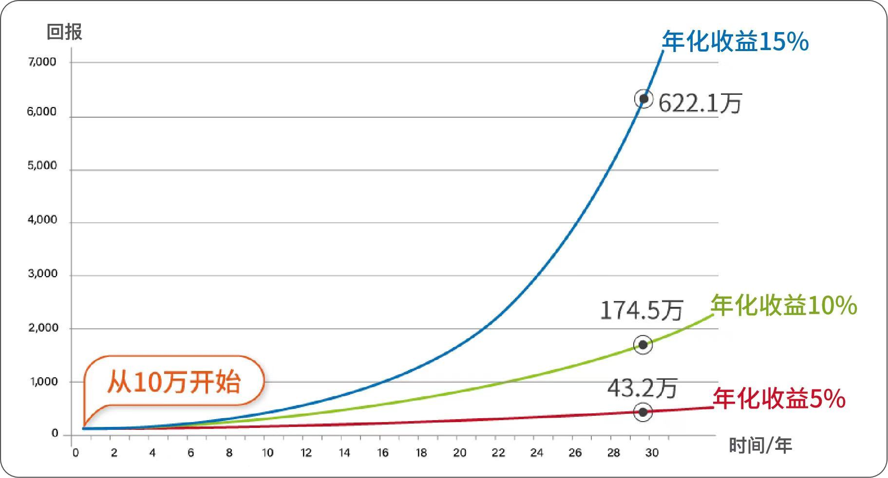

# 理财课程笔记第二天-复利

[TOC]

## 一、本金

- 复利的公式是：<font color = red >**最终收益=本金*（1+收益率）^时间**</font>
- ^，是幂次方的意思，复利多少年就是多少次方。

> 这里的收益率指的是【年化收益率】，而不是每年实际的收益率。

```txt
小黑有10万本金，投资2年，第1年实际收益率为-10%，第2年实际收益率为46.94%，那么小黑的最终收益为：10万90%146.94%=13.225万

小黑每年的年化收益率=15%，小黑的年化收益率不等于每年的实际收益率

根据上面的例子可以看出年化收益率并不是每年实际的收益率，【年化收益率只是一种算法】。
```

> 年化收益率是为了帮助我们更方便的去衡量我们在过去或未来某一段时间内的投资回报的。

### 1.1、复利的公式

- 最终收益=本金*（1+收益率）^时间

- 复利的第一个重点要素：本金
- 第一个因素是本金，本金越多，最终收益越大。
- 但是本金的影响其实没有那么大，而且本金在短期内是很难改变的

#### 1.1.1、提问：你现在有哪个因素的优势呢？🧐

> 提升自己的理财能力

### 1.2、怎么利用好本金

1. 第一就是不能亏损;
2. 第二就是要高效的生钱;

#### 1.2.1、提问：知道把本金放在哪里才能利用好本金吗？

> 放在优质的生钱资产上就可以高效的钱生钱啦，无论价格涨跌，生钱资产都能赚到【现金流】，满足【高效生钱不亏损】的基本原则

## 二、时间

```txt
假设两人都是每月定投1000元，每年的收益率为12%（定投指数基金完全能够达到）

小黑从20岁开始投资，共投资10年，到31岁的时候就不再投入本金

小白从25岁开始投资，一直投入本金直到60岁

当他们到60岁的各自都有多少钱呢(下图有对比)
```



```txt
60岁的时候，小黑有790万，小白有620万，即使小白的投入本金是小黑的3.5倍，最终也还是没有追上小黑。并且，我们可以看到，在人生的各个阶段，小白始终落后于小黑，仅仅就是因为相差了5年。
```

- <font color = red > 所以投资越早开始越好，学习理财越早开始越好 </font>

## 三、收益率

- 收益率影响非常大，年化5%和年化10%，差别是显而易见的。再强调一下，这里的收益率指的是年化收益率。

- 我们在本金不多、时间不占优势的情况下，就要努力提高自己的理财能力，提高自己的收益率，而这个收益率只是表象，支撑内在增长的是什么呢？

  > 答案是⭐理财能力⭐

- 如下图所示，从10万开始，收益率5%、10%、15%，30年后的差异，大家应该都能从曲线就可以看到



### 3.1、提问：哪个要素是我们最容易掌控的呢？

> 收益率

### 3.2、为什么说复利三要素中最容易掌控的是收益率？

> 复利三要素，本金、时间、收益率。
>
> 把钱存在保险箱中，复利会发挥反向作用，把钱一口一口吃掉，长期来看1万元每年贬值500元以上。投资开始的越早，时间要素发挥越大，复利的正向作用越早发挥作用。本金大的人，复利作用也比较大，但是投错了地方，本金再大也会亏完。
>
> 如果本金和时间都不占优势，那么最有效的就是提高年化收益率，而提高年化收益率的关键在于自己的理财能力。

- 通话膨胀就是负向复利！悄无声息，却慢慢影响着大家

> 我们货币的购买力一直在被通胀吞噬着，还是用最典型的例子来说明，90年代的万元户是有钱人，现在只有一万元就是扶贫对象

### 3.3、那穷人和中产不能变富是为什么呢？

- 贫穷的原因很大一部分是因为懒惰，这种懒惰不是身体上的懒惰，而是思维上的懒惰
- 他们虽然知道钱放在银行会贬值，会让通货膨胀吃掉，但是他们懒得行动，不愿意花费一些时间去改变自己，每天躺在舒适区

<font color = red > **记住：你推迟学习理财的每一天，通货膨胀都会发挥复利的【反向作用】，吃掉你的钱。** </font>

> 所以，通货膨胀面前，理财对于人生不是选修课，而是必修课！

## 四、富人的思维

### 4.1、【提问】为什么说投资自己的大脑、学会理财技能是最快的脱贫之法？

> 改变自己思维的懒惰，提升自己的能力，避开复利反向

### 4.2、为什么说投资自己的大脑、学会理财技能也是中产升级之法？

> 如同经典书籍《富爸爸》中说的，穷人卖时间换钱，其实本质是“卖命”。他们抱怨自己没有钱，其实本质是他们没有认识到投资自己的大脑是最快的脱贫致富之法。

```txt
比如一个专家花费一生写了一部巨著，我们花100元买了他的书回来看，其实某种意义上我们是买到了他一生的生命成果，学到了能获得成千上万的收益，这就叫“站在巨人的肩膀上”，贫穷的矮人站在“巨人的肩膀上”也会达到巨人的视野。

但很多人心疼这点投资大脑的钱，所以一直什么都不懂，一直贫穷下去。

反之，穷人也能通过投资自己的头脑，学习他人成功的方法，买他人花了很多时间转化的成果，变成自己的东西，快速创造财富，这是最快的脱贫之法。
```

### 4.3、小结：

一句话总结：

- <font color = red>**心疼投资大脑的钱，一直什么都不懂，不是被通货膨胀割韭菜，就是被投资市场割韭菜，一直穷下去。反之学习他人成功的方法，变成自己的技能，是最快的脱贫、升级之法。**</font>

## 五、总结

### 5.1、【三个重点】：

- 时间、本金、收益率（背后对应的是理财能力）

### 5.2、富人思维-第四条

#### 5.2.1、为什么说复利三要素中最容易掌控的是收益率？

- 复利三要素，本金、时间、收益率。把钱存在保险箱中，复利会发挥反向作用，把钱一口一口吃掉，长期来看1万元每年贬值500元以上。投资开始的越早，时间要素发挥越大，复利的正向作用越早发挥作用。
- 本金大的人，复利作用也比较大，但是投错了地方，本金再大也会亏完。如果本金和时间都不占优势，那么最有效的就是提高年化收益率，而提高年化收益率的关键在于自己的理财能力。

一句话总结：<font color = blue>**【时间无法改变，越早开始越好；本金依赖生钱资产；收益率源于理财能力，理财能力才是决定复利终值的关键】**</font>。

### 5.3、富人思维-第五条

#### 5.3.1、为什么说投资自己的大脑、学会理财技能也是中产升级之法？

- 如同经典书籍《富爸爸》中说的，穷人卖时间换钱，其实本质是“卖命”。他们抱怨自己没有钱，其实本质是他们没有认识到投资自己的大脑是最快的脱贫致富之法。
- 比如一个专家花费一生写了一部巨著，我们花100元买了他的书回来看，其实某种意义上我们是买到了他一生的生命成果，学到了能获得成千上万的收益，这就叫“站在巨人的肩膀上”，贫穷的矮人站在“巨人的肩膀上”也会达到巨人的视野。
- 但很多人心疼这点投资大脑的钱，所以一直什么都不懂，一直贫穷下去。反之，穷人也能通过投资自己的头脑，学习他人成功的方法，买他人花了很多时间转化的成果，变成自己的东西，快速创造财富，这是最快的脱贫之法。

一句话总结：<font color = red>**心疼投资大脑的钱，一直什么都不懂，不是被通货膨胀割韭菜，就是被投资市场割韭菜，一直穷下去。反之学习他人成功的方法，变成自己的技能，是最快的脱贫、升级之法。**</font>

### 5.4、他人总结

- 财富增长公式里的三个要素”本金，收益率，时间” 的弹性不同。
- 时间没有弹性，本金弹性比较小，收益率弹性最大。
- 因此性价比最高的次序是先努力学习提高收益率，然后努力工作提高本金投入，最后长期坚持获取指数增长。


[收益计算器](www.yaocaiwuziyou.com/calculator.html)


