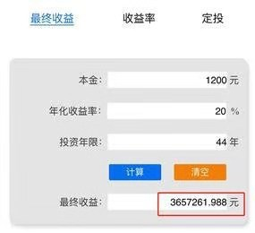
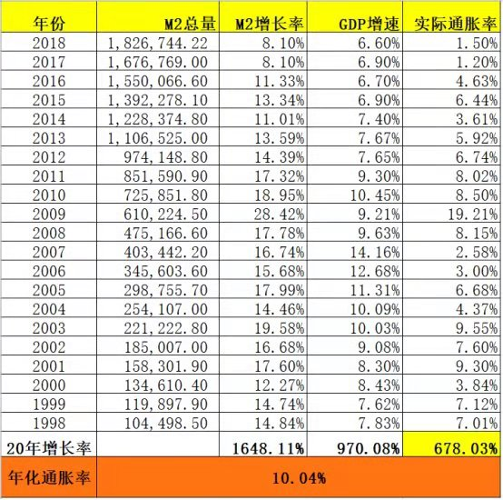
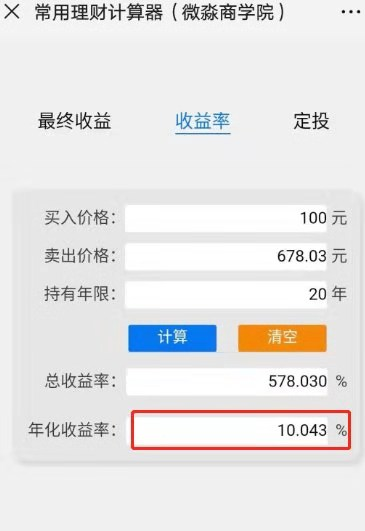
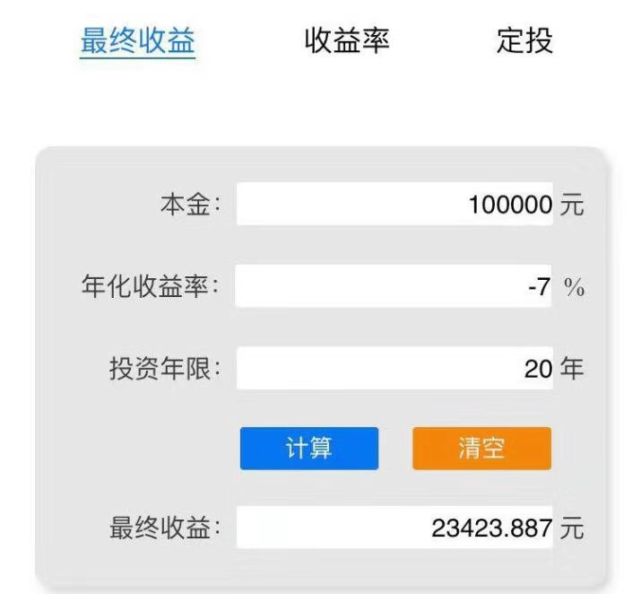
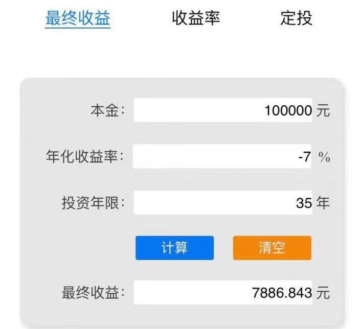

# 理财课程笔记第九天-理财不被割韭菜

[TOC]

## 一、割韭菜

> 比如股市大跌，很多炒股的人被割了韭菜；P2P爆雷，很多P民被割了韭菜；虚拟货币滥发，很多炒币的人被割了韭菜；楼市限购，很多炒房的人被割了韭菜

- 理财可能会被割韭菜，如果不理财是不是就不会被割韭菜了呢？

> 答案是否定的，如果不理财，只会亏的更加悲惨
>
> 因为通货膨胀是世界上最强大的韭菜联合收割机，它收割所有持有现金或现金类投资工具的人。
>
> 44年前（1973年）存入银行1200元，历经44年，得到1484.04元利息，如今取出2684.04元
>
> 如果她选对了一个年化收益率20%左右的好的理财工具，这1200元经过44年的复利可以带来多少收益呢？
>
> 
>
> 答案是365万多，是她存银行收益的一千三百多倍

## 二、什么是通货膨胀？

- 【通货膨胀】=通货+膨胀

通货就是通用货币，也叫法币，就是法律规定的必需使用的货币

- 那么膨胀是什么意思呢？

来看一下这个方程式

**MV=PQ**

 这就是大名鼎鼎的费雪方程式

> M 为货币量
>
> V 为货币流通速度
>
> P 为价格水平
>
> Q 为交易的商品总量

在社会中V和Q一般是比较稳定的，所以货币量M【决定】物价P

货币越来越多，物价就会持续上涨

> 比如你有1万元存款，随着物价的上涨，你能买的东西越来越少，这样钱就越来越不值钱了

## 三、我们手中的钱每年实际贬值到底是多少呢？

- 对于真实的通货膨胀要用到下面这个公式

**实际CPI=M2增长率-GDP增长率**

> M2增长率反映了一个国家每年钱的增长速度
>
> GDP增长率反映了一个国家每年创造的商品和服务的增长速度
>
> 将M2增长率减去GDP增长率，就可以理解为，货币增长比商品和服务增长多出来的部分，这就是实际的CPI，也叫⭐实际通货膨胀率⭐
>
> 
>
> 计算一下实际通胀率
>
> 20年M2增长率=（1826744.22-104498.5）÷104498.5×100%=【1648.11%】

这也就是说过去**20年通货膨胀让每个持有现金的人实际年化亏损10.04%**

可以说过去20年通货膨胀让每个把钱存银行的人实际年化亏损10%。

> 如果你比其他人聪明一点，买了余额宝之类的现金类理财产品。那么你的实际年化亏损大概是7%左右。

假如你现在有10万元，按照年化实际亏损7%计算，20年后会贬值多少呢？

假如你现在有10万元存银行或买余额宝，从购买力的角度来看，20年后实际亏损7.7万，还剩2.3万

如果你现在有10万元，退休时（按35年计算）会贬值多少呢？

假如你现在有10万元存银行或买余额宝，从购买力的角度来看，35年后实际亏损9.21万，还剩0.79万。实际亏损比例高达92.1%。这真是太恐怖了！

## 三、如何不被通货膨胀割韭菜？

那么韭菜有哪些特点呢？

### 1.1、韭菜的第一大特点：

韭菜是投机者而不是投资者

> 【投资】以赚现金流为主，赚差价为辅；【投机】以赚差价为主
>
> 【投资】是赚确定性很高的现金流，在现金收益率高的时候买入，比如投资者会买进高股息率的好股票、高现金分红率的REITs。即使价格不涨甚至下跌，每年也有7%—15%的现金分红收益
>
> 【投机】是通过预测价格变动来赚价差。这有很大的不确定性。因为价格的涨跌是无法预测的，投机其实就是赌博。历史上没有一位投资大师是靠预测价格涨跌变富有的

###  1.2、韭菜的第二大特点：

> 追求短期收益，高频交易，而不是长期投资
>
> 第一、频繁的交易，基本上判了你被割韭菜的命运；
> 第二、不要盼望你能在高抛低吸的短线交易中获胜。

### 1.3、韭菜的第三大特点：

> 不学习或不深入学习，盲目乱投资

## 四、富人思维

- 有的投机者说自己也赚钱了，那么选择做投资者到底好在哪？

> 我们投资理财到底是为了什么呢？赚钱，但进一步想，赚钱是不被钱绑架，能有时间做自己想做的事，能和家人快乐的生活。
>
> 【不懂就去投的人】，短期内碰上运气了，也能赚到钱，但是他们是怎么度过的呢，每天把大量时间用来盯着大盘，昼夜想着跌了还是涨了，精神总是高度紧张，甚至睡觉都在想明天股票的情况，因为他们选择了“赌博”。历史证明，绝大多数投机者本来最应该乐观开心的两年，到头来却是在焦虑、闹心中度过的，因为他们没有真正的投资判断依据，这就是投机者的生活。
>
> 【懂得投资的人】，通过一整套分析方法选出优质的投资目标，算出买入好价格，买入，持有，再算出卖出合理价格，卖出。剩下的时间该干什么干什么，价格跌了，心里知道这是表面的波动，不被其迷惑，拿得住；价格涨了，知道什么时候该卖出，不冲动，赚踏实稳当钱。更厉害的，长期持有，被分红的复利滋润着。这是学习科学方法的自然成果，这也是不学习像苍蝇撞大运的投机者，与踏实学习走正道的投资者的最大差别。
>
> 当然，既不投机，也不投资的人都感受不到这些，他们只能感受到钱越来越不值钱，而自己的生活好像越来越紧吧了。

总结一句话：**投资者获得的是金钱自由，时间自由，心理自由，投机者就算撞运赚了点，却一直在焦虑与煎熬中。**

