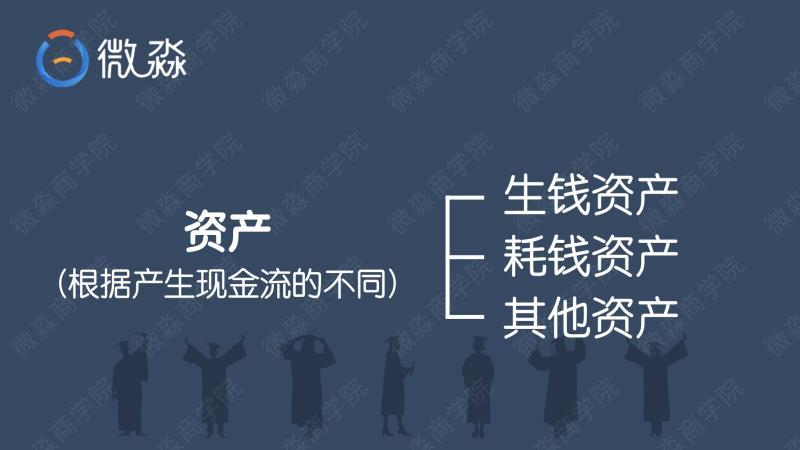
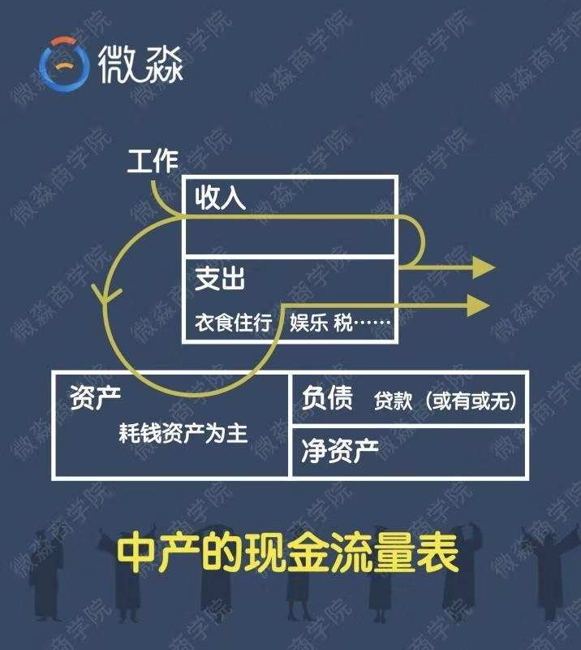
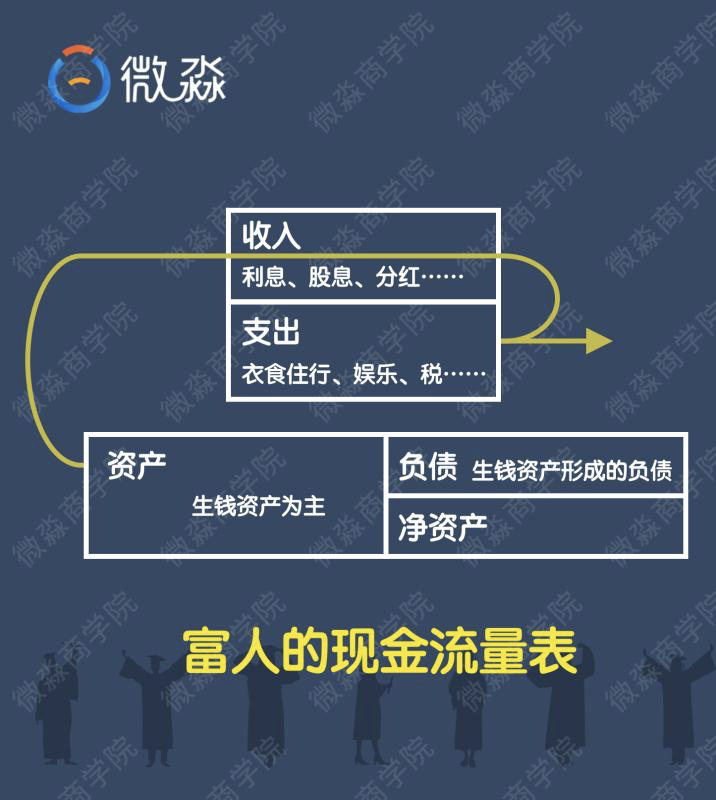

# 理财课程笔记第二天-理财

[TOC]

## 一、什么是理财

> 凡是涉及到跟钱有关的安排，都是理财。

### 1.1、投资与理财的关系

- 投资≠理财，投资只是理财的一部分，理财是一个很广泛的概念。

> 比如制定家庭日常消费计划、投资计划、保险计划、教育金计划、养老金计划等等都是理财中的一部分。

## 二、️什么是资产

- 简单的说资产就是一切可以以货币计量的东西。

> 房子、车子、票子、桌子、椅子、手机、电脑、锅、碗、瓢、勺、股票、基金等都是资产

### 2.1、那么资产的内涵是什么呢？

- 资产的内涵是现金流

### 三、️核心重点二：【三大资产】

- 资产产生现金流的不同就决定了资产的不同。

- 根据资产产生现金流的不同，可以把资产分成3种

### 3.1、生钱资产

- 能给你持续带来净现金流入的东西。

> 强调下，【持续】很重要，持续指每个月、每个季度或每年能不断的给你带来净现金流入。
>
> 如果持有期间没有【持续】的给你带来净现金流入，当你卖的时候才能获得价差收益，那就不是生钱资产。
>
> 有了生钱资产，你就可以躺着数钱了，这就是所谓的【睡后收入】。

#### 3.1.1、【睡后收入】

> 为什么叫【睡后收入】？因为你睡着之后你的生钱资产还在为你赚钱，生钱资产和人的区别是它可以每天工作24小时，全年无休的为你赚钱，并且它还感觉不到累

- 生钱资产不但在你持有期间能赚取确定性很高的净现金流入，还可以在未来你卖出的时候赚价差收益

> 由于生钱资产内在价值高，生钱资产的价格长期来看也会不断的上涨。生钱资产会为你带来净现金流和价格上涨双重收益，所以长期来看生钱资产的收益率也会更高

#### 3.1.2、生钱资产的价格也会下跌吧？不也是会亏钱吗？

> 生钱资产的价格短期内确实也会下跌，但不同的是，生钱资产即使价格下跌了，生钱资产依然会为你带来【持续】的净现金流入，你依然会定期收到钱。也就是说，即使价格下跌，你也会持续的【赚钱】

- 生钱资产的特点决定了生钱资产是一种【无论价格涨跌都能赚钱】的资产

### 3.2、耗钱资产

- 持有期间能给你【持续】带来净现金流出的东西

> 有了耗钱资产，你躺着的时候还在付钱，这就是所谓的【睡后支出】。想想你贷款买的房子，你的车子，你是不是要不断的为它们付钱？
>
> 耗钱资产需要被人养，耗钱资产耗人啊

### 3.3、️其他资产

- 持有期间产生的净现金流为0的东西。

> 其他资产在你持有期间不能给你产生任何收益，你只能在未来卖掉它的时候赚价差。至于未来你的卖出价是否一定会比买入价高，这个只能到时才知道。

- 其他资产，你躺着的时候你就是在躺着。

### 3.4、小结

#### 3.4.1、到底是什么决定了人生的穷富？人生穷富的关键是什么？

- 今天的晚课搞懂了，可以说你就一脚踏入了富人的世界，有钱不一定富有，富有却一定很有钱。

- 这就是我们今天要学习的重点—— **生钱资产和耗钱资产。生钱资产、耗钱资产** 也是理财中最最重要的概念。

- 你的收益有很大的不确定性，所以想通过其他资产长期稳定的赚钱也很难

- 由于耗钱资产持续不断的带来净现金流出，持有耗钱资产的人只有在一种情况下能赚钱，那就是卖出价格大幅高于买入价格时（价差收益还需要覆盖持有期间的净现金流出），但是未来的价格是很难确定的。

- 大家在理解资产时，一定别忘记“持续”二字，**【持续】**带来净现金流入的东西是生钱资产；**【持续】**带来净现金流出的东西是耗钱资产。

## 四、问题

### 4.1、那么这3种资产哪种资产一定能让我们变富呢？

> 生钱资产

### 4.2、那么这3种资产哪种资产可能让我们变富也可能让我们变穷呢？ 

> 其它交道

### 4.3、那么这3种资产哪种资产一定能让我们变穷呢？

> 耗钱资产

### 4.4、怎么做才能财务自由

> - 生钱资产产生的非工资收入覆盖日常总支出
> - 要想富有你只要不断买入生钱资产
> - 同样如果你想变穷，只需不断的买入耗钱资产

## 五、房子和车子的问题

### 5.1、房子是什么资产呢？

1. 假如你有一套房子，没有贷款，租出去获得了租金，给你带来了净现金流入，它就是**生钱资产**

2. 或者说有贷款，但租金能够覆盖每个月的月供、物业费等支出还有剩余，那它也是**生钱资产**

   > 这时的贷款就是好负债，好负债也会让你的钱越花越多

3. 如果是三成首付买的房子自住，不但没有租金收入，每个月还要支付大笔月供以及相应的物业费等，那么它就是**耗钱资产**
4. 即使没有贷款的房子，自己住的这段时间里你还需要为房子付物业费、保险费，产生持续的现金流出，所以没有贷款的自住房也是**耗钱资产**
5. 如果是三成首付买的房子投资，出租出去，租金刚好覆盖月供、物业费各种支出。那这时它就是其他资产啦

> 以上就是房子的3种不同的资产。

#### 5.1.1、房子的问题

- 有个问题没有办法避免，贷款买的房即使当下是耗钱资产，但是5年后房价翻倍，那是不是意味着这套房子具有双重属性呢？

> 这是建立我们资产上面，拿成本，跟你收入对比
>
> 这套房子依然是耗钱资产，耗钱资产是有可能能赚钱的，但是有很大的不确定性。不要忘记资产的内涵哈，未来的房价是任何人没有办法去预测的，有可能上涨，有可能跌，但是现金流它是实实在在的，财务自由不能靠预测市场去实现

- **以后再看房子一定不能只看长相了，要看内涵，要看它产生的净现金流。**

- 房子贷款就是耗钱资产，全款就是生钱资产？

> 当然不是，房子是什么资产只和房子的净现金流有关，和贷款还是全款没有直接关系。

- 既然自住房是耗钱资产，而且我还必须要买一套自住，那么知道生钱资产和耗钱资产有什么用呢？

> 当然是有用的，而且还很有用。首先买入生钱资产类型的房子用来自住，未来房子增值的幅度和概率要远远大于买入耗钱资产类型的房子用来自住。
>
> 其次在投资房子的时候就可以只投生钱资产类型的房子，不投耗钱资产类型的房子。这样的投资行为就会一直成功下去。

 **一定是持续净现金流入才是生钱** 

### 5.2、车子是什么资产呢？

1. 私家车是自用的，每年都有保险费、保养费、停车费等支出，私家车持续的带来净现金流出，所以私家车是**耗钱资产**。

**提问：**如果用这个车在业余的时候跑个顺风车，收入能覆盖掉自己的日常用车支出，还有结余，那么是什么资产呢？

> 还是耗钱资产
>
> 因为开私家车拉活赚的钱需要你投入大量时间和精力，这其实是你的劳动收入。而不是由车本身带来的净现金流入。如果你不拉活，就没有这笔收入，所以私家车还是耗钱资产。
>
> 有一种情况，你把车通过某个租车平台出租出去了，租金去掉各项支出后还有净现金流入，这种情况下私家车才是生钱资产。不过既然是私家车，一般也不会出租的，所以私家车是耗钱资产。

## 六、【工资收入】、【非工资收】

### 6.1、【工资收入】

- 就是自己付出时间、精力、汗水挣来的钱。像我们大部分人都是拿工资的，你必须去上班才有收入，这种就是工资收入。

### 6.2、【非工资收入】

- 就是，你不需要去劳动，也能有收入。

- 就像有人说的：躺着就把钱赚了或者不干活也有钱，比如投资啦，出书的版税啦。

**所以我们应该两手都要抓，两手都要硬。**

- 今天的课程要建立两个关键富人思维，这个就是其中一个，一定要切记。

  > 很多小伙伴说没钱，但没钱只是不学习理财的结果 而不是你不学习理财的原因。
  >
  > 因为靠工资攒钱是最低效最差的方式，如果只靠工资收入来攒钱，很可能到退休了还没有攒够理财的本金。
  >
  > 聪明的小伙伴会在获得第一笔工资收入时，就开始选择合适的理财工具来积累自己的本金和非工资收入了。
  >
  > 具有富人思维的人即便是月光，或者积蓄不多的时候，就会从一开始就通过工资和非工资收入两条路径来增加自己的收入。
  >
  > 两条腿走路肯定比只靠工资收入一条腿走的更快更远。

一定深入领会这段话，一句话总结：**提升财富要靠工资和非工资收入两条腿走路，绝对不能独腿前行。**

## 七、富人思维

### 7.1、普通人、中产阶级现金流

> ⭐️中产的资产中主要是耗钱资产，以房子、车子为主
>
> ⭐️中产可能有贷款也可能没有贷款
>
> ⭐️中产的收入主要来自工资收入
>
> ⭐️中产把工资收入变成了耗钱资产，耗钱资产不停消耗中产的钱。

- **为了养耗钱资产，中产是不能停止工作的。由于耗钱资产的存在，中产几乎是很难变富有的。**

### 7.2、富人资产现金流

1. 富人的收入主要来自生钱资产！
2. ️生钱资产产生的现金流入完全能够覆盖各种支出。
3. ️富人不用为了生活而去工作！

### 7.3、成为富人的两个秘密是什么？

✅ **生钱资产占总资产的80%以上；**

✅ **好支出占总支出的80%以上。**

这就是富人的两个秘密！大家课后一定要牢记！

### 7.4、那对应穷人的两个死穴又是什么？

1. 相对应的穷人的第一个死穴：**毫无任何生钱资产可言！生活唯一的经济支柱就是工资！**
2. 相对应的穷人的第二个死穴：**不知道支出也分好坏！坏支出占了总支出的80%以上。**

### 7.5、中产家庭为什么不能沉溺在自己的工资收入中？

#### 7.5.1、【孩子还未成人的家庭】

- 孩子没有收入，花销逐年增大，这时候如果夫妻中有一人遇到一段时间不能工作的情况，家庭财务整体情况可能会出现较大落差，进而影响生活质量。

#### 7.5.2、【全职宝妈的家庭】

- 女性负责照顾孩子，没有工资性收入，只有老公一人的收入是家庭收入的主要来源，如果老公遭遇大裁员等意外情况，家庭很可能立即陷入坐吃山空的财务危机中，或者啃老的尴尬境地。

所以中产家庭更需要尽早尽快建立自己的非工资收入体系，【在没发生意外的时候】，可以为家庭提供一份额外的收入，补贴家用；【在发生意外的时候】，能够抵御财务风险，不至于到毫无收入的被动地步。

**学习并掌握获得非工资收入的能力，是为自己负责，也是为家人负责。**

🔆一句话总结：**中产的【财务安全】来自工资收入和非工资收入的双管齐下，没有充足非工资收入的中产家庭，谈不上财务真正安全。**

## 八、总结

### 8.1、核心关键，大家要记住3+2，也就是三大资产、两大富人思维。

#### 8.1.1、三大资产

生钱资产、耗钱资产、其他资产，判断他们的关键是【持续的】净现金流的流入和流出。

#### 8.1.2、两大富人思维

**月光或者积蓄不多的人，为什么不能等有钱再学习理财？**

- 月光和积蓄不多本质是错误理财思维造成的结果，

1. 【在花钱上】，很多都是坏支出，一心只想买买买，很多东西在冲动消费之后要么用了几次就放置一边，要么后悔自责又在下次陷入到恶性循环，但对于投资自己成长的好支出，却又思前想后。其关键在于，没有好支出、坏支出的思维意识，被欲望牵着走，没有将有限的资金花在刀刃上。

2. 【在攒钱上】，单纯靠工资攒钱是最低效最差的方式，如果只靠工资收入来攒钱，很可能到退休了还没有攒够理财的本金。真正聪明的小伙伴会在获得第一笔工资收入时就开始选择合适的理财工具来积累自己的本金和非工资收入了。

> 具有富人思维的人，哪怕是现在月光或者积蓄不多，就会从一开始就通过工资和非工资收入两条路径来增加自己的收入。两条腿走路肯定比只靠工资收入一条腿走的更快更远。

一句话总结：**提升财富要靠工资和非工资收入【两条腿】走路，绝对不能独腿前行。**

**中产家庭为什么不能沉溺在自己的工资收入中？**

> 中产家庭看似收入比较稳定，其实抗风险能力不强，他们有房贷要还，小孩要养，甚至父母还要大量的开销。

1. 【孩子还未成人的家庭】，孩子没有收入，花销逐年增大，这时候如果夫妻中有一人遇到一段时间不能工作的情况，家庭财务整体情况可能会出现较大落差，进而影响生活质量。

2. 【全职宝妈的家庭】，女性负责照顾孩子，没有工资性收入，只有老公一人的收入是家庭收入的主要来源，如果老公遭遇大裁员等意外情况，家庭很可能立即陷入坐吃山空的财务危机中，或者啃老的尴尬境地。

> 所以中产家庭更需要尽早尽快建立自己的非工资收入体系，【在没发生意外的时候】，可以为家庭提供一份额外的收入，补贴家用；【在发生意外的时候】，能够抵御财务风险，不至于到毫无收入的被动地步。

学习并掌握获得非工资收入的能力，是为自己负责，也是为了家人负责。

一句话总结：**中产的【财务安全】来自工资收入和非工资收入的双管齐下，没有充足的非工资收入的中产家庭，谈不上财务真正安全。**

