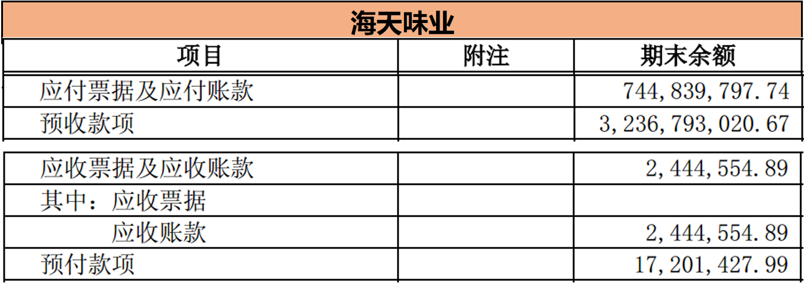
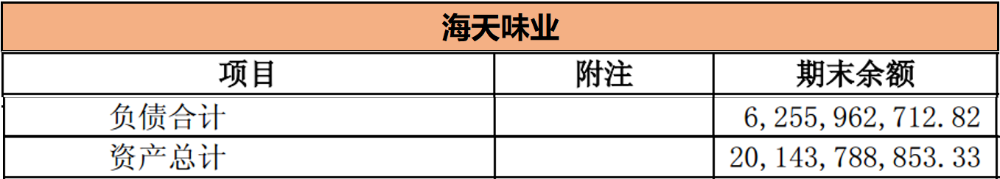
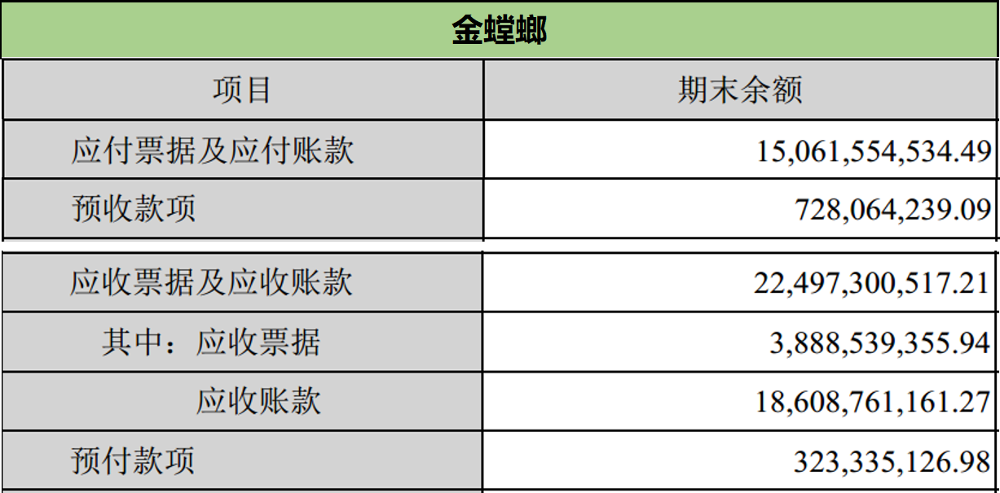
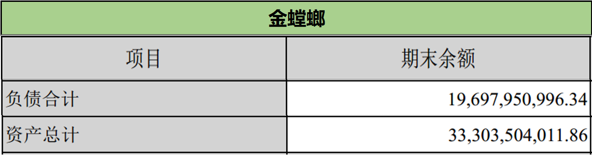
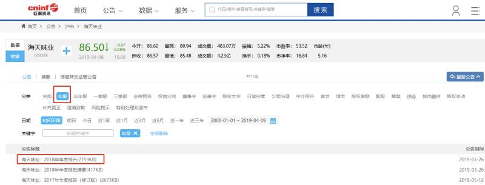
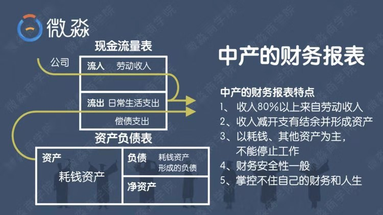
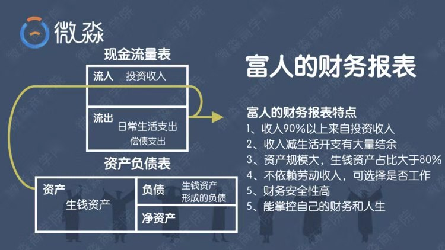

# 理财课程笔记第五天-财务报表

[TOC]

## 一、财务报表

如下图财务报表关键数据

- 企业1





- 企业2





### 1.1、财务报表-四个名词

#### 1.1.1、应付

- 应付账款和应付票据。货你已经用了，但是钱还没给供应商。【先用货，后给钱】，是不是很牛？

#### 1.1.2、预收

- 预收款项。先收了经销商的钱，但是货还没有给。【先收钱，后发货】，是不是很牛？

#### 1.1.3、应收

- 应收账款和应收票据。货已经被经销商拉走了，但还没收到钱。【先发货，收不到钱】，是不是不那么牛？

#### 1.1.4、预付

- 预付款项。钱已经给供应商啦，但是货还没收到。【先给钱，收不到货】，是不是也不那么牛？

#### 1.1.5、汇总一下：

> ⭐应付：【先用货，后给钱】，牛！
> ⭐预付：【先给钱，收不到货】，不牛！
>
> ⭐预收：【先收钱，后发货】，牛！
> ⭐应收：【先发货，收不到钱】，不牛！

### 1.2、竞争力

- 【应付预收】减去【应收预付】，看竞争力
- 【应付预收】减去【应收预付】，<font color = red>**数值越大，竞争力越强**</font>

### 1.3、安全性

**那通过什么科目来判断公司的安全性呢？**

> <font color = blue>**负债率**</font>-->可以用资产负债率来判断两家公司的偿债风险

<font color = red>**总负债÷总资产=资产负债率**</font>

1. ⭐️资产负债率大于70%的公司，偿债风险比较大
2. ⭐️资产负债率小于40%的公司，几乎没有偿债风险

**示例**

```txt
你有100元的现金，这时候你还有70元的债务，相比于只有40元的债务，如果遇到个意外要花钱，你（70元的债务）肯定抗风险的能力弱，也就是财务的安全性差。
```

## 二、上市公司财报

### 2.1、上市公司财报下载

1. 推荐下载上市公司的财报地址：http://www.cninfo.com.cn/new/index （巨潮资讯网）
2. 操作步骤：进入巨潮资讯网—输入代码—查看公告搜索（选择年度报告）
3. 

### 2.2、看财报有方法

```txt
其实，看财报有方法，记住：
【看财报重点看结构，而不是看数字，看财报有23个具体步骤，按步骤来就可以看懂】 
【看结构也一目了然了，看数字谁看谁晕】
```

### 2.3、温馨提示

- 现在就是知道了【竞争力】和【安全性】的知识点，就会比什么也不知道就瞎买的人好很多！
- 大家要知道：股票的本质就是企业，买股票就等于买企业
- 这里的【竞争力】和【安全性】是可以用来淘汰那些你们蠢蠢欲动要买的自以为好的“坏公司”，但是不是直接用来选股，因为财报肯定不只这两个指标，选择一家好企业肯定也不止这两个指标。
- 所以别贪图快钱，就拿了这2个指标去选，小心被割韭菜，还是要谨记我们的投资第一原则

### 2.4、财报-工作

- 财报的用途不仅仅是上面所说，找工作也好用
- 以后在跳槽的时候，先通过财务报表看一下这家公司是不是一家好公司
- 要知道，咱们选择企业，不可能把所有的上市公司财报全部分析一遍 
- 开始的时候会通过财务指标海选出一部分公司   再去精选。然后再去分析财报 
- 财报是用来排雷的  就是看它究竟是不是所谓的好公司

下面聊天记录为财报分析讨论：


- <font color = red>**按照分析财报的23个步骤。去判断一家公司的好坏。**</font>

```txt
找工作其实也是一项投资，上班投入的是时间。时间才是最宝贵的资源

投入的时间最后能获得多少回报，一方面和自己创造的价值有关，一方面和公司的好坏有关

有的同学可能会说，我要找的公司没有上市呢，怎么去看它的财务报表呢？

如果想要跳槽的目标公司没有上市，那就看一下同行业的上市公司！

如果同行业的上市公司情况比较好，那么这个行业可能就比较好

如果连同行业的上市公司情况都不太好，那么目标公司你就不用去了
```

## 三、通过财务报表就能读懂自己和别人未来的财运


- 大部分关于【钱】的问题，我们都可以从财务报表上找到答案

- 通过财务报表，我们不但能够了解一个人，一个家庭现在的财务状况，而且在某种程度上我们还可以预见到一个人，一个家庭未来的财务状况。

提问：资产大的人一定是富人吗？

> 耗钱资产过多的就不是富人
>
> 有资产的人也可以分为中产和富人

### 3.1、什么是富人？什么是中产呢？

- 富人指“生钱资产”在总资产中的占比大于80%的人。
- 中产指“生钱资产”在总资产中的占比小于80%的人。
- 有无资产，拥有什么类型的资产，决定了一个人最终会成为什么样的人
- 从资产类型来分析是不是就感觉，其实贫富的差距，就是思维的差距 

#### 3.1.1、中产财务报表



- 1️⃣  中产的“耗钱资产”规模将会越来越大，现金流出也会越来越大，所以中产不能停止工作。经济繁荣的时候，中产的财务风险不大，一旦经济萧条，“中产”将面临较大的财务风险。
- 2️⃣  在中产没有改变自己财务报表的资产结构之前，中产不能实现财务自由。
- 3️⃣  如果中产调整资产结构，让“生钱资产”在总资产中的占比达到80%以上，中产也能比较容易实现财务自由。

> 其实财务自由离大家并不遥远，只要你掌握了选择生钱资产的技能。只要不断拥有生钱资产，加以复利，都会实现财务自由！
>
> 掌握了正确的方法，财务自由只是时间问题！
>
> 虽然财务自由不会马上实现，但是你手里的生钱资产会让你的财务状况越来越好
>
> 其实生钱资产给你带来源源不断的现金流就好像给你发工资一样

#### 3.1.2、富人财务报表



1. 擅于区分“耗钱资产”、“其他资产”和“生钱资产”，擅长创造“生钱资产”
2. 只要保持 “生钱资产”在总资产中的比重大于80%，富人就会持续的保持成功并变得越来越富有

### 3.2、什么叫有钱的穷人呢？

> 具备富人思维的有钱人在生活中并不多见

- 其实在我们生活中最常见的就是车贷、房贷一起养的中产
- 在生活中比较常见的是不具有富人思维的有钱人
- 他们确实很有钱，但是思维模式依然是穷人的思维模式，财务报表的特点更像是中产的特点而不符合富人的特点
- 有钱的穷人，其成功多具有偶然性，难以持续，一旦失败，很难东山再起

### 3.3、那怎么样改变自己现在无产或者中产的现状呢？

- 其实无产、中产、富人也是可以相互转换的

- 无产通过努力工作和学习适当的理财技能就能变成中产

- 中产遇到经济危机也可能变成无产

- 无产和中产掌握了理财技能，升级了思维观念也能变成富人

- 富人一般情况下是不会变成中产或者无产的，因为富人精通理财技能。富人只会变的越来越富有，直到最终变成富豪

- 通过努力工作和学习适当的理财技能，增加生钱资产的人在未来一定能实现财务自由

  ### 3.4、那什么样的家庭一定能富过三代呢？

- 子孙三代具有富人思维和技能，都能准确识别生钱资产，并一直维持生钱资产占总资产的比率大于80%的家庭会富过三代
- 反之，就是由富转贫穷的结局了

## 四、富人思维

- 提问：为什么月光和负债的人更应该拿出一部分资金学习理财技能？
- 这里的负债主要指的是：让自己的财务状况不断恶化的【坏负债】。

> 月光和负债只是不懂理财的结果，没有理财技能才是月光和负债的原因。
>
> 很多人一方面不懂投资的骗局，一方面又眼红想赚一下，最终都入了骗局的“坑”，如果提前投资自己的大脑，难道还会犯这样的错误吗？
>
> 还有很多人，本来钱就不多，贷款买了一堆耗钱资产，要么不断的刷信用卡、花呗、借呗，窟窿越来越大，要么生活拮据，每天人前风光，人后遭殃。
>
> 但对于投资自己，提升理财技能的好负债，他们却斤斤计较，错失了复利的好机会，这样的人生活只会越来越难过。
>
> 【成长有顺序，生活致富也有顺序】——先投资大脑，掌握理财的技能，然后再去生钱，月光、负债不学习只会越来越穷

一句话总结：<font color = red>**月光、负债是财务病，病根是缺少理财技能，忽视病因、不治病根，坏支出、坏负债只会越来越严重。**</font>

## 五、总结

### ️5.1、【第一个重点】

> 通过财报看企业，用安全性和竞争力淘汰你手里的坏企业。

### ️5.2、【第二个重点】

> 中产与富人的关键区别在于是否能够识别生钱、耗钱、其他资产，并科学的持有他们。

### 5️.3、【第三个重点】

> 无产、中产、富人是可以相互转换的，学好理财技能就能由穷转成中产，由中产转成富人。

### 5.4、【关键富人思维--第七条】

- 为什么月光、负债的人应该拿出一部分资金学习理财技能？
- 这里的负债主要指的是让自己的财务状况不断恶化的【坏负债】。

```txt
月光和负债只是不懂理财的结果，没有理财技能才是月光和负债的原因。很多人一方面不懂投资的骗局，一方面又眼红想赚一下，最终都入了骗局的“坑”，

如果提前投资自己的大脑，难道还会犯这样的错误吗？还有很多人，本来钱就不多，贷款买了一堆耗钱资产，要么不断的刷信用卡、花呗、借呗，窟窿越来越大，要么生活拮据，每天人前风光，人后遭殃。

但对于投资自己，提升理财技能的好负债，他们却斤斤计较，错失了复利的好机会，这样的人生活只会越来越难过。
```

- <font color = blue>【成长有顺序，生活致富也有顺序】——先投资大脑，掌握理财的技能，然后再去生钱，月光、负债不学习只会越来越穷</font>

- 一句话总结：<font color = blue>月光、负债是财务病，病根是缺少理财技能，忽视病因、不治病根，坏支出、坏负债只会越来越严重。</font>

