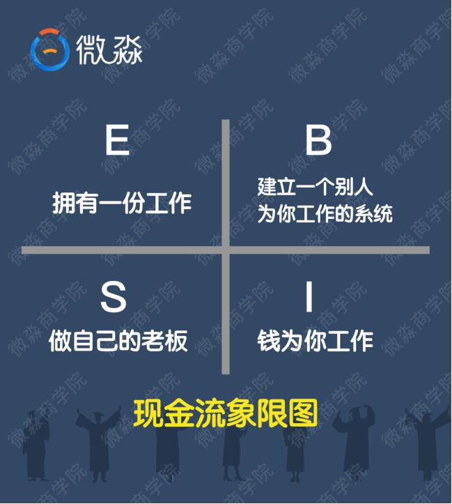
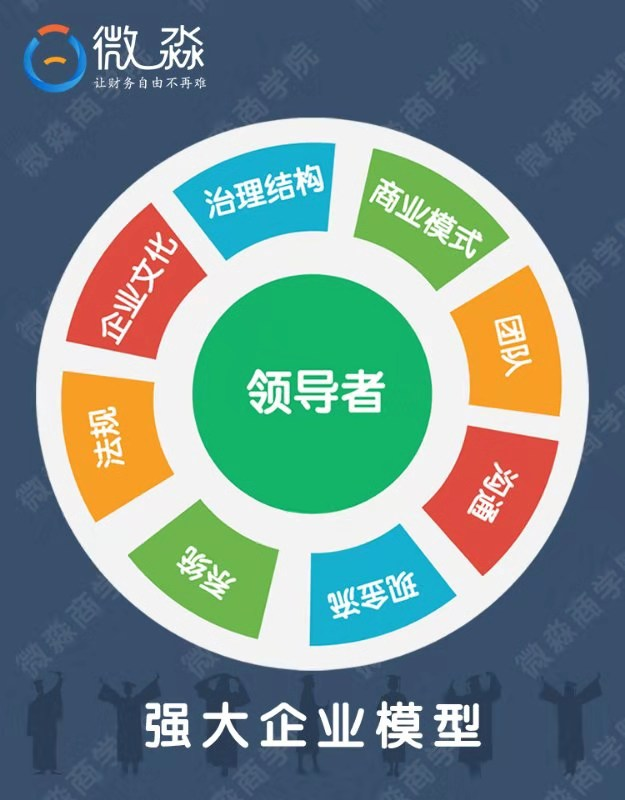

# 理财课程笔记第六天-企业

[TOC]

## 一、四类人群与企业的关系

- 学理财为什么要学企业呢？

> 【因为】买股票就是买公司，投资要学企业；打工族如果学了企业更有助于升职加薪，上班要学企业；创业者学了企业能大幅提高成功概率，创业也要学企业
>
> 尤其是打工族们，如果你的企业分析技能，超过你的上司，你比你的老板还会为公司更加全面的考虑问题，并解决问题，为公司带来更大价值，那你可能不升职加薪吗？

### 1.1、对于【理财投资】来讲，企业是一个绕不开的工具。

> 1. 投资股票就是投资企业；
> 2. 投资股权是投资企业；
> 3. 投资债券（企业债、可转债），也是投资企业。

投资REITs也可以看作投资企业（一个极简的房地产管理企业），分析REITs的财务报表和分析企业的财务报表都是一样的。

### 1.2、四象关系

生活中的人按照收入来源划分，主要可以分为四类。

> ① E 象限的人拥有一份工作，绝大部分人的工资收入都是企业发的
>
> ② S 象限的人是自己为自己打工，但是他们的收入很多也是来自自己的小企业（很可能不是公司制企业）
>
> ③ B 象限的人都是大企业主，他们的企业一般都能不依赖于企业家本人独自运转。
>
> ④ I 象限的人让钱为自己工作，是投资家

- B象限的人和S象限的人可能都拥有一个企业，那谁来说说B象限和S象限最大的区别是什么？

  最大的区别是：

  > B象限的企业离开了B象限的人照样可以运行的很好
  >
  > 而S象限的企业离开了S象限的人就会倒闭

  归根到底是因为：**B象限的人比S象限的人更了解企业**

- 可以看到：这个世上的大部分人，无论是赚【工资收入】还是赚【非工资收入】，这些收入基本都和【企业】有关
- 那么如果想要提高收入，就要了解企业。无论你是【打工者】、【自由职业者】、【企业家】还是【投资家】，你越了解企业，你就越富有

**这四个象限中收入最高的人都是最【了解企业】的人**

## 二、企业与个人职业发展、创业

- 同学们现在思考一个问题：在【1年内】把自己的收入【提高2倍】，你应该怎么办

  > 有的同学是不是觉得，这怎么可能，我做不到呀！
  >
  > 其实这也是典型的穷人思维
  >
  > 就像让大家写总结、做分享一样，有的同学写得特别好，有的同学说老师我不会写，你连试都不试就说不会？对吗？这是富人思维吗？
  >
  > 富人会怎么想呢？富人此时想的不是我做不到，而是我怎么才能做到。

  **并非困难使我们放弃，而是因为放弃，才变得如此困难**

  > 如果你在这1年内拿出时间好好研究企业，学习【企业】相关知识，一年以后你的收入有可能会【提高2倍以上】的。
  >
  > 特别是当你现在的月收入在1万以内时，效果更明显。

假如现在一家大公司请你做CEO，在公司内部你有至高无上的权力，你也想把这家公司管理的更好，那么你需要做的最重要的事情有哪些呢？

是不是很多人都想过我要是当了CEO多厉害多厉害，可是真让你一二三四五的说出来具体的做法就又说不出来了？

> CEO也需要掌握相应的技能才能做好CEO
>
> 如果你的技能不过关，即使让你做了这个位置你也很快会下来的
>
> 就像没学习之前，大家都想财务自由，可是怎么才能实现财务自由呢？
>
> 很多人是不知道的

## 三、企业与投资、估值

- CEO需要掌握哪些技能呢？

>  企业分析工具——强大企业模型

强大企业模型，包括9个关键要素。这9个关键要素是：领导者、企业文化、治理结构、商业模式、团队、沟通、现金流、系统、法规。

### 3.1、【强大企业模型】主要有哪些作用呢？

1、可以指导我们像CEO一样去思考企业的问题。

2、可以指导我们【从0到1】创造一家企业；

3、可以指导我们【从1到100】做强一家企业；

4、可以指导我们看明白别人的企业，当我们想要【投资或者加盟】一家企业的时候，我们就更容易【做出正确的决策】。

- 为什么强大企业模型可以指导我们像CEO一样思考问题呢？

> 这是因为CEO要做的最重要的事情都是和这9大要素相关的事情。了解了这9大要素，就了解了CEO工作的重点，我们自然可以像CEO一样去思考和解决企业的问题。

### 3.2、像CEO一样思考问题对我们有什么用呢？

1、哪怕自己现在所处的位置是最底层，也能从企业的全局去思考问题，很多问题就有了更多更好的解决方式。这样你就更可能得到高管甚至老板的认可，从而加快自己升职的速度。

2、更重要的是当你很了解企业的时候，你就能牢牢的抓住一些本来不属于你但最后却属于你的重大机会。

- 途径可能不止一个，但是了解企业，用好企业这个工具肯定是最主要也是最有效的一个因为在E、S、B、I四个象限中，绝大部分人都与企业有关。

- 强大企业模型还有一个非常强大的功能，是什么呢？

  > 指导我们分析清楚一家企业。
  >
  > 1、在跳槽的时候能选出更有发展潜力的好公司，在职业发展上获得超额回报。
  > 同样是做一份工作，在好公司和普通公司，我们最终的回报肯定是有巨大不同的。
  >
  > 2、在做投资的时候就能选出好公司，给企业估值，大幅降低投资风险，获得年化20%甚至更高的收益率。

> 我们知道投资股票就是投资企业，那怎么知道一家企业值不值得投资呢？
> 如果你不知道一家企业的内在价值，无论你在什么价格买入，无论你用什么方法去投资，其实都是投机
>
> 要知道股票值不值得买？你需要先知道它的内在价值是多少，内在价值也可以叫合理市值
>
> 如果一家企业很好，而且它的市值大幅低于合理市值，那就是非常值得投资；如果一家企业很好，但是它的市值远远高于合理市值，那也暂时不能买。

- 下面我们就来看看如何用强大企业模型去分析一家企业并对其估值？

  > 要对一家企业估值需要掌握好财务报表和企业分析技能才能进行，现在同学们暂时还不具备这两方面的技能，所以我们只讲一下思路。
  >
  > 以Facebook为案例，从商业模式和现金流2个要素做了分析。这里说一下，我们以后做投资的时候，要从这9大要素去分析公司，而不能只分析其中的2个要素。
  >
  > 判断Facebook未来3年的净利润能否持续增长，主要看护城河！

### 3.3、什么是护城河呢？护城河主要有几种？

- 护城河也叫核心竞争力，是竞争对手无法复制或模仿的竞争优势。护城河主要有4种：网络效应、转换成本、成本优势和独特资源

>  世界上有70%以上的企业，这4种护城河一个也不具备。
>
> 一个企业只要具有1种护城河就有强大的生存能力和较好的盈利能力。
>
> 如果同时具备2种护城河，企业一定是行业龙头公司。
>
> 同时具备3种或以上护城河的企业，这个世界上也不超过100家。

长期持有具备3种或以上护城河的企业想不赚钱都困难。

我们最好买具有3个或3个以上的企业，至少也要买具有2个或2个以上的企业

### 3.4、给企业估值的公式是

**公式：市值=净利润*市盈率**

### 3.5、企业未来某年的合理估值公式是

**合理市值=未来某年净利润*合理市盈率**

- 怎么才能相对准确的估算出一家企业未来3年的净利润呢？
  不能凭空去想象，需要掌握好企业和财报分析技能。

## 四、富人思维

- 为什么工作者、投资者都需要通晓企业分析技能？

>  并不是创业者 、大老板才需要了解企业。
>
> 普通人更需要了解企业

### 4.1、【投资中】

股票本质是企业，只有把9大要素都分析清楚，才能分析出好企业，才能给企业估值。

### 4.2、【工作中】

干工作的时候也要有企业经营的思维,这样才更容易升职加薪。

即便不为升职，干工作的时候也要有企业经营的思维。因为当你站在更高层去看自己的工作内容的时候你才能更好的理解自己的工作内容，这样你可以把工作做成老板真正想要的样子。

而那些只盯着自己的岗位的“井底之蛙”，有的时候挨了骂都不知道为什么，因为他缺乏跳出自己的框框看企业的技能，这就是他自己工作干不好的原因。

所以无论投资、工作，都需要通晓企业分析技能

总结一句话：**上班者用企业分析模型看透工作，投资者用企业分析模型看透股票**

## 五、总结

⭐【第一个重点】，E\B\S\I，四类人群与企业的关系

⭐【第二个重点】，企业与个人职业发展、创业

⭐【第三个重点】，企业与投资、估值

### 5.1、一个关键富人思维

【关键富人思维第十条】
为什么工作者、投资者都需要通晓企业分析技能？

⭐并不是创业者 、大老板才需要了解企业。
【投资中】，股票本质是企业，只有把9大要素都分析清楚，才能分析出好企业，才能给企业估值.
【工作中】，干工作的时候要有企业经营的思维，这样才更容易升职加薪。

即便不为升职，干工作的时候也要有企业经营的思维。因为当你站在更高层去看自己的工作内容的时候你才能更好的理解自己的工作内容，这样你可以把工作做成老板真正想要的样子。

而那些只盯着自己的岗位的“井底之蛙”，有的时候挨了骂都不知道为什么，因为他缺乏跳出自己的框框看企业的技能，这就是他自己工作干不好的原因。

所以无论投资、工作，都需要通晓企业分析技能。

总结一句话：工作者用企业分析模型看透工作，投资者用企业分析模型看透股票

