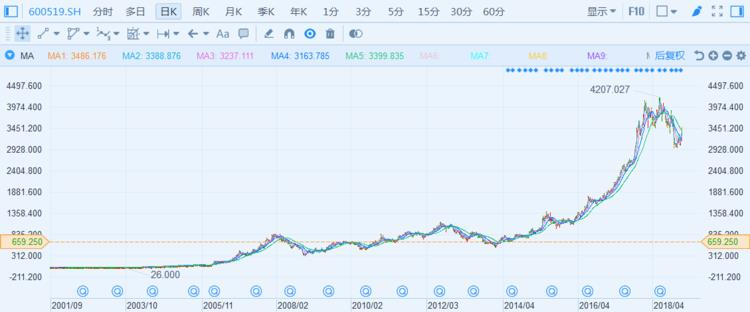
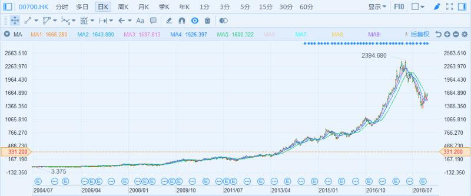
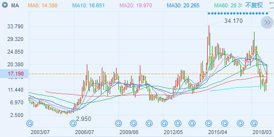
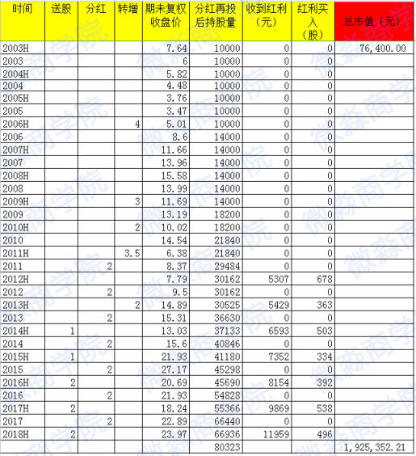
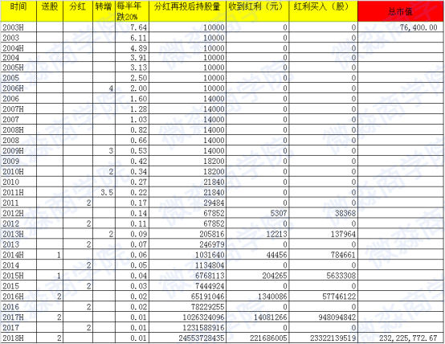

# 理财课程笔记第六天-反常识-股票暴跌收益会更高

[TOC]

## 一、股票的本质

> 正确的系统的股票投资技能包括：**理财的底层逻辑、富人思维，股票的海选～精选出好公司～财务报表分析～企业分析～计算好价格～制定买进标准～制定持有标准～卖出标准等**

### 1.1、第一个重点：认识股票，股票到底是什么？

- 【股票】是公司的所有权凭证。持有股票的人是公司的股东，拥有公司的一部分。可以说你持有一家公司的股票，你就是这家公司的老板😎
- 持有股票比例最多的人，是这家公司的大老板，持有少的人是小老板
- 无论是大老板还是小老板，拥有的很多权力是一样的。比如有分红的权利、了解公司财务状况的权利、表决的权利等
- 投资一家好公司的股票，拥有这家公司的一小部分，成为这家公司的股东，也是实现财务自由甚至是成为富豪的重要途径

### 1.2、为什么股票的收益率那么高呢，真的是因为它高风险吗？

- 可以确定的说，一国股市的平均收益率一定是远远大于该国的GDP增长率的🤓
- 比如中国现在的GDP为6.5%左右，中国股市的年化收益率一定是远大于6.5%的
- 因为GDP的组成中，企业是创造价值最多的部门
- 所以：好上市公司的平均收益率 >所有上市公司的平均收益率>所有企业的平均收益率>GDP>银行理财收益率

**根据统计：**

> 中国的GDP大概6.5%以上；
> 中国所有上市公司的平均年化收益率大概12%以上
> 中国好公司的平均年化收益率大概24%以上

1. 如果不想自己创业，想比较舒服的实现财务自由，好公司的股票是一个非常好的选择
2. 买了好公司的股票就相当于中国甚至世界最优秀的管理团队为你打工

 **以上就是股票的内涵** 

## 二、选好股票的标准-->实际是选出好公司

### 2.1、什么样的股票算是好股票？

> 收益率和平均年化收益率的区分
>
> 收益率：一个是到期收益多少，
>
> 平均年化收益率：一个是平均年化是平均每年赚多少钱 

- 股票的本质是企业，好企业的股票就是好股票

看三个例子

第一个例子：贵州茅台

- 从2003年到2018年15年间，贵州茅台的股票价格从26元涨到了4207元（后复权价），涨了160倍，年化收益率40%
- 大家想一想，如果03年你有1万元，具备了选择好公司的技能，把它放在茅台上，你是不是现在也能轻松当上百万富翁了呢？

**小科普：不复权价格是真实的价格，后复权则显示的它的真实价值**

第二个例子：腾讯

- 腾讯控股，从2004年到2018年14年间，腾讯控股的股票价格从3.4港元涨到了2394港元（后复权价），涨了700倍，年化收益率59%
- 可以说：只要你买到了好公司的股票，以公司所有者的心态长期持有，终将获得丰厚收益

第三个例子：通化东宝

> 对于股票越跌越有收益这件事，是不是有点不明白？

例如通化东宝，主要是通化东宝很普通

- 普通的意思是它不是特别优秀的公司。市场同类竞争对手多，在上市公司中并不算很好的公司，最多算是中等偏上，比较有代表性

其次是通化东宝股价波幅比较大

这个图上这个例子主要是感受它的起伏大波动

- 通化东宝2003年7月1日的收盘价为7.64元。假设你在这天投入7.64万，买入1万股，买入后股价一路下跌，最低跌到了2.95元
- 2年时间浮亏61%，这买入价够差劲的吧？
- 现在来假设，你买入后持有不动至2018年6月30日，你完全忘记了股价的波动，满仓经历了所有的腰斩。你所做的，只是在每年收到分红时，直接按照当时股价无脑买入
- 经计算，至今你持有80323股通化东宝，按照2018年6月底收盘价23.97元计算，当前市值192.5万元，15年的年化收益率24%
- 
- 看到了吗，这么大的波动，竟然还有年化24%的收益，这不是假设，是真实的哦，符合标准的才会买入，赚你看得懂的钱。

**来一个假设**

- 现在假设，你以7.64元的价格买入就遇到一个长达15年的超级大熊市，股价每半年就暴跌20%，如果你遇到了这种暴跌，你应该算的上史上最“悲惨”的投资者了。每半年跌20%，持有15年跌幅高达99%以上啦。
- 经历一个持续15年的超级恐怖大熊市，你的7.64万，究竟会剩下多少呢？
- 

- 截止到2018年6月30日，你持有通化东宝245亿股，股价0.01元，对应市值2.32亿元，年化收益率70.68%。
- 股价持续大暴跌的收益居然这么高。
- 现实中是不会出现这种情况的。
- 资本是逐利的，除你之外的资本一定一定一定会参与抢购，从而抬高股价。这是不以人的意志为转移的经济规律，这是基本的经济学常识。
- 我们要看到事物背后的本质，这才是投资者致胜的法宝。
- 通过财报分析和企业模型分析后，你就会知道，通化东宝一直在盈利，除此之外，经过我们严格的分析体系可以得出，它在其他方面也是中等偏上的

## 三、选出好公司，要有一套科学的分析体系（财报分析、企业分析）

### 3.1、如何才能分析出好公司？

- 学好了财报分析、企业分析方法（特别是关于商业模式、护城河、领导者、团队的分析）才可能选出好公司

## 四、富人思维

### 4.1、股票价格大跌能跌出什么？

1. 我们【投资股票正确的方法】可以分为两大步：

> 第一步：选出内在价值高的好企业
>
> 第二步：在价格大幅低于内在价值的时候，及时买入
> 这两步是不能颠倒的。 
>
> 

2. 【当股市的价格出现下跌时】

> 好企业代表的好股票会出现好的买入价格，但是坏企业会跌出让投机者眼红的“陷阱”。
>
> 如果在选择企业这一步错了，不管是多便宜的价格都徒劳无功，反而损失惨重。

3. 【理性的投资者】

> 对自己无法预测股票价格有自知之明，因为价格的波动总是难以预测的，因此他们将主要精力放在好企业的选择上，当好价格出现的时候果断出手，而后不管是继续跌还是涨，都是任凭风浪起稳坐钓鱼船。
>
> 他们一般很少看股票，却获得了很高的收益。

4. 一句话总结：

   > 股票大跌既有机会也有陷阱，机会的识别需要眼力，机会的把握需要技能，当眼力和技能配不上这个机会的时候，往往会步入陷阱之中。

### 4.2、很多人炒股亏钱，就说股票风险高，到底该怎么看待投资股票这件事？

1. 【投机炒股的人】，

> 不懂就去投，一心想赚一把就走，那么股市就是一个大赌场，都特别想赢钱，但又特别怕输钱，风险自然是非常大
>
> 而且还很容易上当受骗，赚了以为是自己本事，亏了又说运气不好，说到底都是自欺欺人。
>
> 涨了开心要命，跌了悲伤绝望，被价格的波动带着一天悲喜两重天，说到底还是没有技能让自己内心踏实

2. 【真正的投资股票】

> 是关注股票代表的公司的好坏，是看到股票背后的本质，经过严谨的分析得出的结论。
>
> 这样的投资，即使短时间的价格波动也能心理踏实，最终能够获得复利带来的长期收益

3. 一句话总结：

> 投资股票的正确姿势是靠分析，能选出好股票风险自然就小。赌徒在股市是把身家性命交给市场，不懂就投，肯定要被懂的人收割的。

## 五、总结

### 5.1、三个重点

1. 第一个重点：股票的本质
2. 第二个重点：选好股票的标准——实际是选出好公司
3. 第三个重点：选出好公司，要有一套科学的分析体系（财报分析、企业分析）

### 5.2、富人思维

#### 5.2.1【关键富人思维-第八条】

⭐股票价格大跌能跌出什么？

> 我们【投资股票正确的方法】可以分为两大步：
> 第一步：选出内在价值高的好企业
> 第二步：在好的价格及时买入
> 这两步是不能颠倒的。 

- 【当股市的价格出现下跌时】，好企业代表的好股票会出现好的买入价格，但是坏企业会跌出让投机者眼红的“陷阱”。如果在选择企业这一步错了，不管是多便宜的价格都徒劳无功，反而损失惨重。

- 【理性的投资者】对自己无法预测股票价格有自知之明，因为价格的波动总是难以预测的，因此他们将主要精力放在好企业的选择上，当好价格出现的时候果断出手，而后不管是继续跌还是涨，都是任凭风浪起稳坐钓鱼船。他们一般很少看股票，却获得了很高的收益。

**一句话总结：**

股票大跌既有机会也有陷阱，机会的识别需要眼力，机会的把握需要技能，当眼力和技能配不上这个机会的时候，往往会步入陷阱之中。

#### 5.2.2、【关键富人思维--第九条】

⭐很多人炒股都亏，就说股票风险高，到底该怎么看待投资股票这件事？

> 【投机炒股的人】，不懂就去投，一心想赚一把就走，那么股市就是一个大赌场，都特别想赢钱，但又特别怕输钱，风险自然是非常大
>
> 而且还很容易上当受骗，赚了以为是自己本事，亏了又说运气不好，说到底都是自欺欺人。
>
> 涨了开心要命，跌了悲伤绝望，被价格的波动带着一天悲喜两重天，说到底还是没有技能让自己内心踏实
>
> 【真正的投资股票】，是关注股票代表的公司的好坏，是看到股票背后的本质，经过严谨的分析得出的结论。
>
> 这样的投资，即使短时间的价格波动也能心理踏实，最终能够获得复利带来的长期收益

**一句话总结：**

投资股票的正确姿势是靠分析，能选出好股票风险自然就小。赌徒在股市是把身家性命交给市场，不懂就投，肯定要被懂的人收割的。

